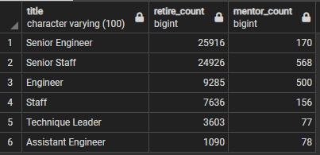

# Overview
The purpose of this analysis is to identify employess who are retiring and those that are eligible for a mentorship program in order to prepare for the "silver tsunami".

# Results
Below are four major points from the analysis between retiring employees and employees eligible for the mentorship program.

- ## Number of retiring compared to mentorship eligibile by title

    Running the below query to summarize retired employees by title and eligible mentorship employess by title, it is clear there are more senior positions being vacated than there are employees to be mentored.

    ```sql
    SELECT rt.title 
	,rt.count as retire_count
	,me.mentor_count
    FROM retiring_titles rt
    JOIN (
        SELECT COUNT(*) AS mentor_count, title
        FROM mentorship_eligibility
        GROUP BY Title
    ) me ON rt.title = me.title
  ```

    

- ## Percentage of senior level positions retiring

    70% of retiring employees are holding senior level positions. 

- ## what percentage of leadership does retiring hold?

- ## 

# Summary